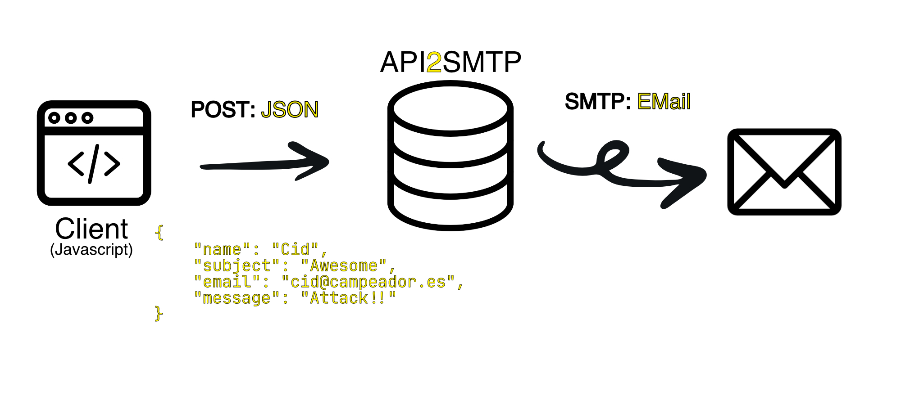

<p align="center">
   
</p>

## Run

1) Make sure you have Java installed.

Debian/Ubuntu

``` sh
sudo apt install default-jre
```

Mac OS

``` sh
brew install java
```

2) Create a file `config.yaml` with the following content. You can also use `config.yaml.example` as a base config and change it to fit your needs.

``` yaml
# It can be a domain in case of using a proxy: example.com
domain: localhost
# It indicates which domain can use it. Debug true so there are no limitations.
domain-cli: localhost
# If it is active it will be accessible to any client
debug: true
port: 7404
#SMTP config
smtp-from: "no-reply@domain.com"
smtp-to: "my@domain.com"
smtp-subject: "Contact"
smtp-host: "smtp.domain.com"
smtp-user: ""
smtp-password: ""
smtp-port: 587
smtp-tls: true
```

3) Download the latest version of Glosa (`api2smtp-{version}-standalone.jar`).

https://github.com/tanrax/api2smtp/releases


4) Now you can execute api2smtp.

```sh
java -jar target/api2smtp-{version}-standalone.jar
```

Great 🎉. You already have your 🔥 own API send mails 🔥.

That's it, now you just have to test that it works properly.

``` sh
curl -H "Content-type: application/json" -d '{
	"name": "Cid",
	"subject": "Awesome",
	"email": "cid@campeador.es",
	"message": "Attack!!"
}' 'localhost:7404/api/v1/email/'
```

---

<p align="center">
  Thanks to the power of <a href="https://www.tadam-framework.dev/"> Tadam Framework</a>
</p>
